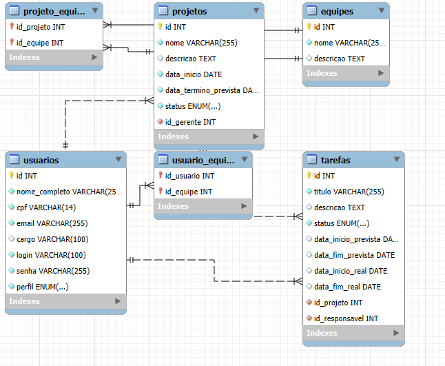

# Gestão de Projetos - Sistema Desktop

> **Status:** Projeto Concluído (Versão para Entrega Acadêmica - Setembro/2025)

## 📖 Descrição do Projeto

Este projeto é um sistema de gestão de projetos e equipes, desenvolvido como solução para a Unidade Curricular de Programação de Soluções Computacionais. O objetivo é criar uma plataforma desktop centralizada para otimização do gerenciamento de projetos, superando os desafios de processos manuais e descentralizados.

O sistema permite o controle efetivo dos projetos, a atribuição de tarefas aos colaboradores e o acompanhamento do andamento das atividades, garantindo a integridade e a segurança das informações através de um banco de dados relacional.

## ✨ Funcionalidades Principais

* **Autenticação Segura:** Tela de login para garantir que apenas usuários autorizados acessem o sistema.
* **Dashboard de Navegação:** Um menu principal que serve como ponto de partida para todas as funcionalidades.
* **Módulo de Projetos:** Cadastro de novos projetos e listagem de todos os projetos existentes em uma tabela.
* **Módulo de Usuários:** Cadastro de novos usuários (colaboradores, gerentes, etc.) com diferentes perfis de acesso.
* **Módulo de Tarefas:** Cadastro básico de novas tarefas, com associação a um projeto e a um usuário responsável.
* **Interface Intuitiva:** Telas com componentes dinâmicos (listas de seleção) e melhorias de usabilidade (navegação com a tecla "Enter").

## 🛠️ Arquitetura e Tecnologias

A arquitetura do sistema foi projetada para ser robusta e organizada, seguindo padrões de mercado.

* **Linguagem:** Java (JDK 21 LTS)
* **Interface Gráfica:** Biblioteca Swing
* **Banco de Dados:** MySQL
* **IDE:** IntelliJ IDEA
* **Testes:** JUnit 5 para testes unitários.
* **Padrão de Arquitetura:** MVC (Model-View-Controller), DAO (Data Access Object) e Factory.

## 🗃️ Estrutura do Banco de Dados (DER)

A base do sistema é um banco de dados relacional que garante a integridade dos dados.

## 🚀 Como Executar o Projeto

**1. Pré-requisitos:**
* Java JDK 21 ou superior.
* MySQL Server.
* Uma IDE Java, como o IntelliJ IDEA.

**2. Configuração do Banco de Dados:**
* Crie um schema no seu MySQL chamado `gestao_projetos`.
* Execute o script SQL do projeto para criar as tabelas.

**3. Configuração da Conexão:**
* No arquivo `src/factory/ConnectionFactory.java`, altere as credenciais de acesso ao banco (usuário e senha), se necessário.

**4. Execução:**
* O ponto de entrada da aplicação é a classe `view/TelaLogin.java`. Execute o método `main` desta classe para iniciar o sistema.

## 👥 Autores

| Nome | Função |
| :--- | :--- |
| **Pablo Henrique Santana Bernardino** | Desenvolvimento Back-end, DAO e Testes |
| **Jessica Vieira Ramos Gonzaga** | Desenvolvimento Front-end (Views) e Apresentação |
